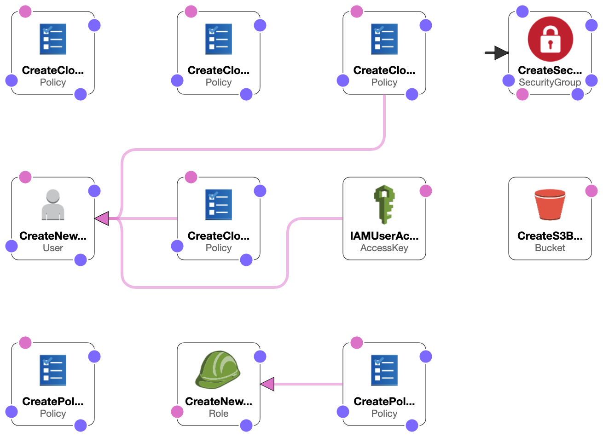
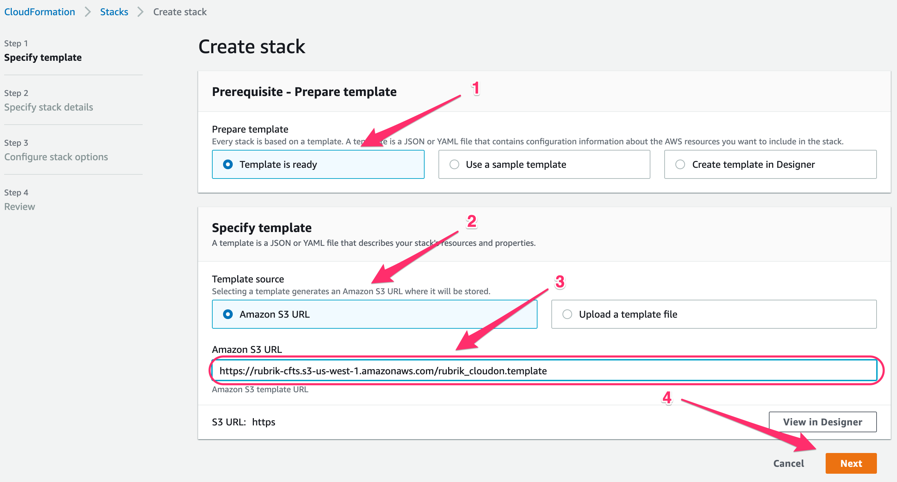
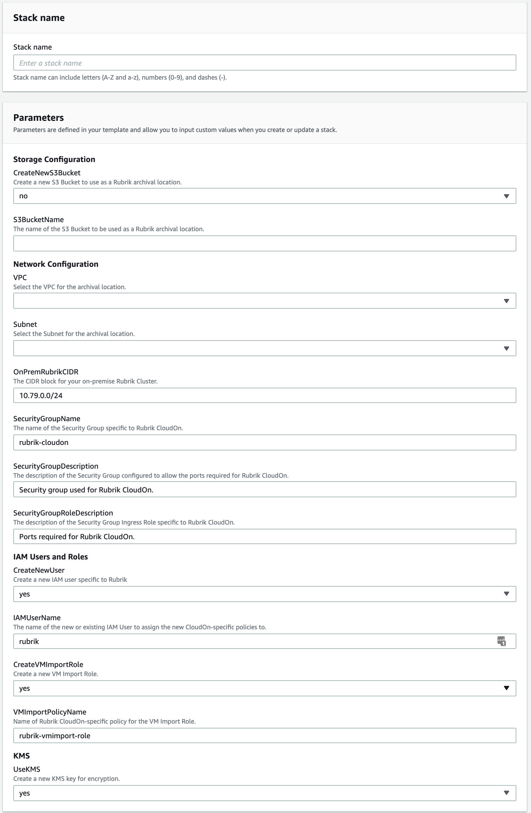

# Quick Start: AWS CloudFormation Template for CloudOn

Complete the AWS configuration process required for the Rubrik CloudOn feature which provides the ability to convert a snapshot, an archived snapshot, or a replica into an Amazon Machine Image (AMI) and then run that AMI on an Amazon virtual private cloud (VPC).

The end-to-end workflow is as follows:

* Create Policies
* Create IAM User, Role, and Access Key
* Create Security Group
* Create S3 Bucket*
* A new KMS key is created (optional)

_* The template can also consume a previously created IAM User or S3 Bucket_



This is automated as a part of the CloudFormation template, however, permission templates can be found in this repo:

* [`cloudon_security_policy.json`](../cloudon_security_policy.json)
* [`cloudout_security_policy.json`](../cloudout_security_policy.json)
* [`vmimport.json`](../vmimport.json)

# CloudFormation Stack

Navigate to **Services** > **CloudFormation** > **Stacks** and select **Create Stack**.


Either select **Upload a template to Amazon S3** or, preferably, **Specify an Amazon S3 template URL**.



The template file can be downloaded [here](https://rubrik-cfts.s3-us-west-1.amazonaws.com/rubrik_cloudon.template). Copy the following URL:

```url
https://rubrik-cfts.s3-us-west-1.amazonaws.com/rubrik_cloudon.template
```

On the **Specify Details** page, enter the **Stack name** and the **S3BucketName**.



Press **Next** through the **Options** page.

Use the **Review** page to ensure all the information is correct. Press **Create** once reviewed.

Follow the Rubrik CDM User Guide to complete the setup.

# Variables

This section provides information regarding the variables used in the template.

## Storage Configuration

| Variable  |  Default | Description  |
|---|---|---|
| CreateS3NewBucket | no | Create a new S3 Bucket to use as a Rubrik archival location.|
| S3BucketName | n/a |The name of the S3 Bucket used as a Rubrik archival location.|

## Network Configuration

| Variable  |  Default | Description  |
|---|---|---|
| VPC | n/a | Select the VPC for the archival location. |
| OnPremRubrikCIDR | 10.79.0.0/24 (example only) | The CIDR block for your on-prem Rubrik Cluster. |

## IAM Users and Roles

| Variable  |  Default | Description  |
|---|---|---|
| CreateNewUser | yes | Create a new IAM user specific to Rubrik CloudOn. If 'no' is selected the S3 IAM policy will be attached to the provided IAMUserName which should already be created. |
| CreateVMImportRole |yes | Create a new VM Import Role. If the vmimport role has already been created or if another stack controls the vmimport role creation process select 'no'. |
| IAMUserName | rubrik-cloudon | The name of the IAM User to assign the new CloudOn specific policies to. |

## Optional

Default names and descriptions for the various IAM Users, Policies, and Security Group created during the process.

| Variable  |  Default | Description  |
|---|---|---|
|SecurityGroupName | rubrik-cloudon | The name of the Security Group specific to Rubrik CloudOn. |
| SecurityGroupDescription | Security group used for Rubrik CloudOn. | The description of the Security Group configured to allow the ports required for Rubrik CloudOn. |
| SecurityGroupRoleDescription | Ports required for Rubrik CloudOn. |The description of the Security Group Ingress Role specific to Rubrik CloudOn |
| VMImportPolicyName | rubrik-vmimport-role | Name of Rubrik CloudOn specific policy for the VM Import Role. |

Output from the CloudFormation template:

| Variable | Description |
|---|---|
| IAMUserAccessKey | Access Key for the new IAM User.  (if applicable) |
| IAMUserSecretKey | Secret Key for the new IAM user.  (if applicable) |
| SecurityGroupId | ID for the newly created Security Group |
| VPCId | VPC ID where the Rubrik Bolt Instance is created. |
| SecurityGroupId | Security Group ID that will be appied to the Rubrik Bolt Instances. |
| KMSKeyId         | The KMS Key ID used for encryption. (if applicable) |
| Region           | The AWS Region where the configuration took place.  |
